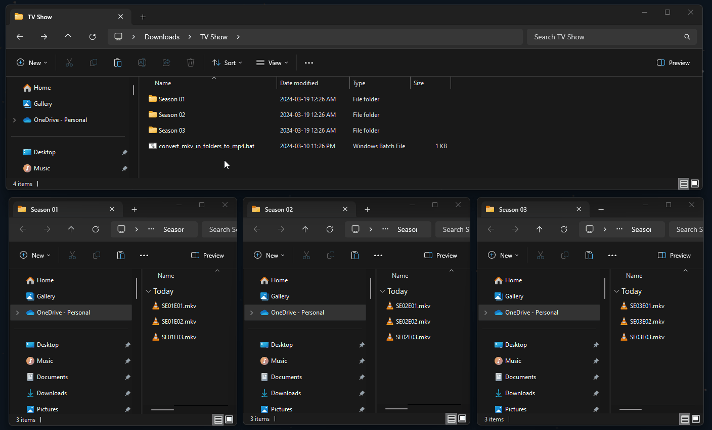

## Description

A batch script to convert files from `.mkv` to `.mp4` within subfolders.

The script will:

1. Convert all `.mkv` files to `.mp4`

2. Delete the original `.mkv` files

3. Delete itself

## Dependencies

This script requires [ffmpeg](https://ffmpeg.org/) to be installed and added to PATH.

## Usage

> I recommend downloading this script so you can copy it when needed.

1. **Copy** this script to the folder containing the subfolders.

2. Double-click to run.

