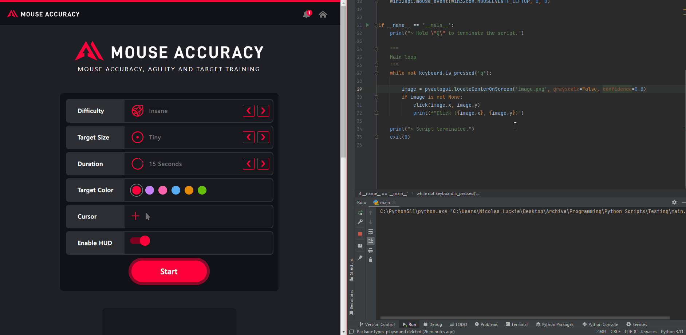

<h1 align="center">Find-and-Click</h1>

    A Python script that finds and clicks an image on the screen! 
    Tested using <a href="https://mouseaccuracy.com/" target="_blank">https://mouseaccuracy.com/</a> 

