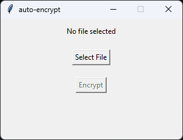
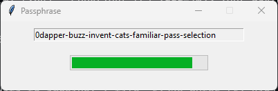

<h1 align="center">🔐 <code>auto-encrypt</code></h1>

## Description
A simple Python script that encrypts a file with a randomly generated passphrase using 7-Zip and shreds the original file using BleachBit.

## Requirements
- Python 3.8 or higher
- 7-Zip installed and added to PATH
- BleachBit installed and added to PATH
- A `words.txt` file containing a list of words, one per line, in the same directory as the script

## Usage

- Run the script with `python auto-encrypt.py` or simply run `auto-encrypt.bat`

- A GUI window will appear, asking you to select a file to encrypt

- Click "Select File" button and select a file
- Click "Encrypt" button to start the encryption process
- The script will use 7-Zip to create a password-protected archive with the file, using the highest compression level and encrypting the file names
- The script will then use BleachBit to securely delete the original file, overwriting it with random data
- A second GUI window will appear, showing you the passphrase that was used to encrypt the file

- The passphrase consists of seven words separated by dashes, with a random number inserted before or after one of the words
- The window will close automatically after 20 seconds, and the passphrase will not be saved anywhere
- You can copy the passphrase from the window before it closes, or write it down somewhere safe
- You will need the passphrase to decrypt the file using 7-Zip