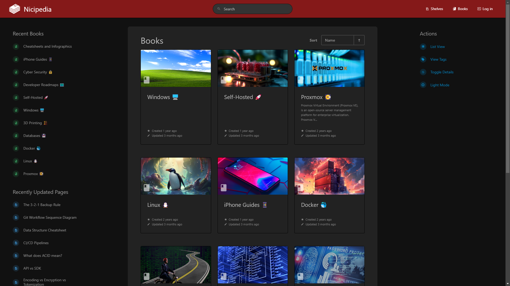

# BookStack

A platform to create documentation/wiki content built with PHP & Laravel.

Personally, I use the version maintained by LinuxServer.io for quicker deployment, and because I trust them.



- LinuxServer code source: https://github.com/linuxserver/docker-bookstack
- Official web source: https://www.bookstackapp.com/
- Official code source: https://github.com/BookStackApp/BookStack

## Docker Compose Quickstart

```yaml
version: "2"
services:
  bookstack:
    image: ghcr.io/linuxserver/bookstack:latest # use a specific version tag to prevent breaking changes
    container_name: bookstack-site
    environment:
      - PUID=${PUID}
      - PGID=${PGID}
      - APP_URL=${APP_URL}
      - DB_HOST=${DB_HOST}
      - DB_USER=${DB_USER}
      - DB_PASS=${DB_PASS}
      - DB_DATABASE=${DB_DATABASE}
      - APP_ENV=${APP_ENV}
      - APP_DEFAULT_DARK_MODE=${APP_DEFAULT_DARK_MODE}
    volumes:
      - ./data/config:/config
    ports:
      - 6875:80 # to change the port, change only the first number (e.g. 8080:80)
    restart: unless-stopped
    depends_on:
      - bookstack_db
  bookstack_db:
    image: lscr.io/linuxserver/mariadb
    container_name: bookstack-db
    environment:
      - PUID=${PUID}
      - PGID=${PGID}
      - MYSQL_ROOT_PASSWORD=${MYSQL_ROOT_PASSWORD}
      - TZ=${TZ}
      - MYSQL_DATABASE=${DB_DATABASE}
      - MYSQL_USER=${DB_USER}
      - MYSQL_PASSWORD=${DB_PASS}
    volumes:
      - ./data/db:/config
    restart: unless-stopped
```

## .env file

```ini
# Bookstack variables
PUID=1000
PGID=1000
TZ=Etc/UTC
APP_URL=https://bookstack.example.com # if not using a reverse proxy, use http://localhost:6875
APP_ENV=production
APP_DEFAULT_DARK_MODE=true # (optional)

# Database variables
DB_HOST=bookstack_db
DB_USER=bookstack
DB_PASS=changeMe
DB_DATABASE=bookstackapp
MYSQL_ROOT_PASSWORD=changeMeToo # different from DB_PASS
```

**Folder Structure:** (Setup)

```
./bookstack/
    ├── .env
    └── docker-compose.yaml
```

**Folder Structure:** (Deployed)

```
./bookstack/
    ├── data/
    │   ├── config/
    │   └── db/
    ├── .env
    └── docker-compose.yaml
```

## [Documentation](https://www.bookstackapp.com/docs/)